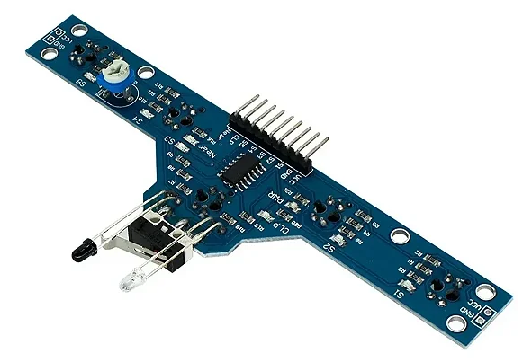
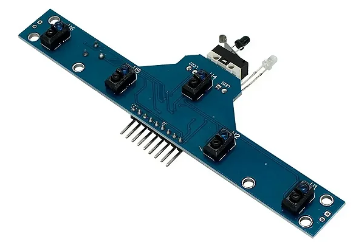
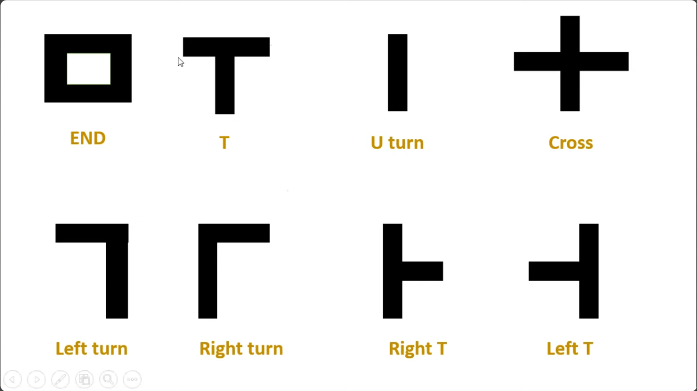
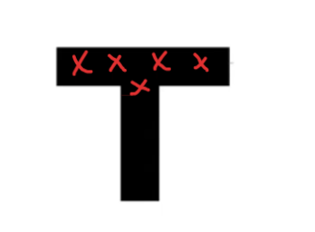
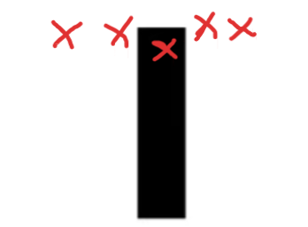
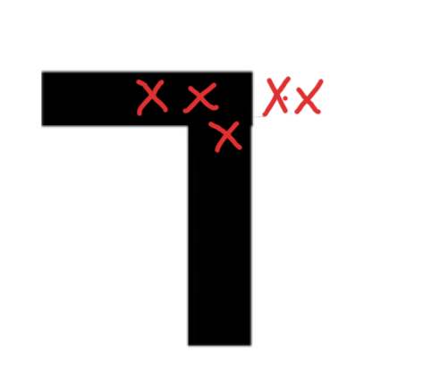
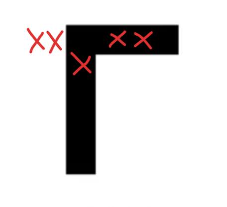
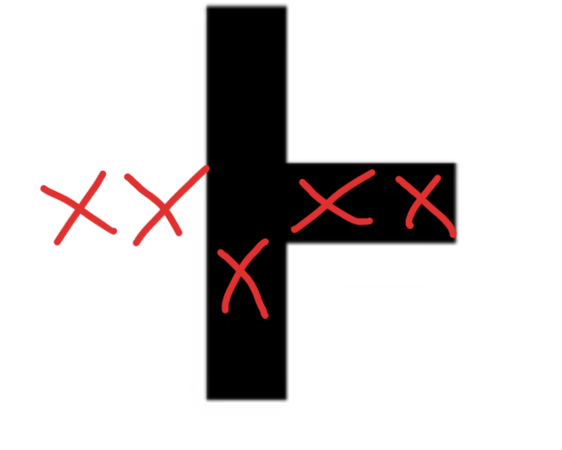
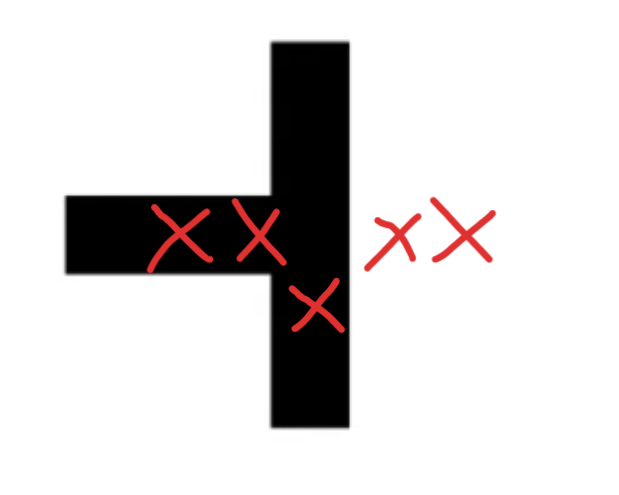

## Representação

O código C++ é direcionado para um seguidor de linha que possui o seguinte sensor de infravermelho:



Nome: MÓDULO TCRT5000 5 CANAIS



## Junções

*  Na competição, é comum de ter retas e curvas durante o percurso. Todavia, é também necessário estar preparado para outros tipos de formas na pista, representados abaixo:
  


* O código precisa saber o que fazer nessas situações, pessoalmente, acredito que não todas as situações descritas acimas, porém as que são mais importantes:

->  T
-> Left turn
-> Right Turn
-> Right T
-> Left T

* Até o momento, o código trata as seguintes situações nas condicionais:

-> Left Turn
-> Right Turn
-> U turn

Aqui o trecho condicional do código:

```c++
if (sensorAtras && !sensorExtremaEsquerda && !sensorMeiaEsquerda && !sensorMeiaDireita && !sensorExtremaDireita) 
// primeira lógica: seguir para frente
{
return 0;
} else if (sensorExtremaEsquerda && sensorMeiaDireita && sensorAtras && !sensorMeiaDireita && !sensorExtremaDireita) 
// segunda lógica: ir para a esquerda
{
return 1;
} else if (sensorExtremaDireita && sensorMeiaDireita && sensorAtras && !sensorMeiaEsquerda && !sensorExtremaEsquerda) 
// terceira lógica: ir para a direita
{
return -1;
} else if (sensorAtras && sensorExtremaEsquerda && sensorMeiaEsquerda && sensorMeiaDireita && sensorExtremaDireita) 
// lógica quando o carrinho encontra um "T" na linha
{
return 2; // precisamos ver como faremos a lógica de decisão nesse sentido
} else
{
return 3; // pensar em mais lógicas possíveis (exemplo: se nenhum dos sensores estiverem indentificando nada, parar)
}
```

## Como o infravermelho de 5 sensores localiza a linha, em cada situação:

### T
* Em uma situação em que o infravermelho reconhece o T com o TCRT5000, a representação é o seguinte:



### U turn



### Left turn



### Right turn



### Right T



*ATENÇÃO:* Note que o infravermelho TCRT5000 lê o RIGHT TURN igual ao RIGHT T.

### Left T



-> Por conseguinte, LEFT T também lê igualmente como LEFT TURN.

## Resultado

* Pela representação das imagens, é possível ver que também há falhas com o infravermlho de 5 sensores, visto que, seria necessário um sexto sensor (um que fica a frente) para diferenciar L[...]

-> Ainda assim, é melhor que a implementação anterior, com 2 sensores.

## O que fazer? 

-> Precisamos ver como faremos, implementar o Infravermelho de 5 sensores, e refatorar o código com base no que podemos tratar.

## Perguntas

-> Qual é a largura, da extremidade esquerda à direita, do seguidor de linha?
